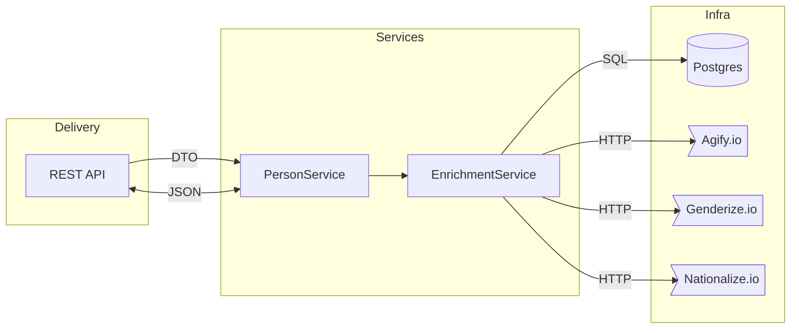
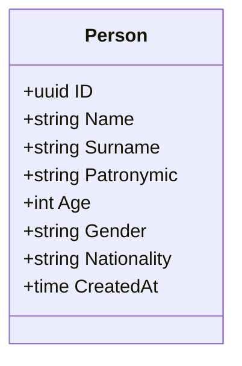

# Effective Mobile — Person Enrichment Service

> **Тестовое задание для компании «Effective Mobile»**

---

## 📑 Оглавление

<!-- TOC -->

* [Описание структуры проекта](#описание-структуры-проекта)
* [Полный текст задания](#полный-текст-задания)
* [Обзор решения](#обзор-решения)
* [Архитектурная диаграмма](#архитектурная-диаграмма)
* [Доменная модель](#доменная-модель)
* [Покрытие тестами](#покрытие-тестами)
* [Сборка и запуск проекта](#сборка-и-запуск-проекта)
* [Примеры запросов](#примеры-запросов)


<!-- /TOC -->

---

## Описание структуры проекта

```text
Effective-Mobile/
├── .github/            
│   └── workflows/
├── build/              
├── cmd/
│   └── server/         # Точка входа
├── configs/            # Конфигурация в yaml
├── docs/               # Swagger
├── internal/           # feature modules
│   ├── app/
│   ├── config/
│   ├── delivery/
│    └── http/
│   ├── domain/
│   ├── repository/
│    └── postgres/          
│   ├── service/                      
│   ├── util/
│    └── logger/      
├── migrations/         # SQL-миграции
├── .env.example        # Шаблон переменных окружения
├── Makefile            # build, test, run, migrate targets
├── go.mod / go.sum     # Зависимости
└── README.md           
```


---

## Полный текст задания

<details>
<summary>Тык</summary>

Реализовать сервис, который будет получать по API ФИО, из открытых API обогащать
ответ наиболее вероятными возрастом, полом и национальностью и сохранять данные в
БД. По запросу выдавать инфу о найденных людях.

**Необходимо реализовать следующее:**

1. **Выставить rest методы**
    - 1 Для получения данных с различными фильтрами и пагинацией
    - 2 Для удаления по идентификатору
    - 3 Для изменения сущности
    - 4 Для добавления новых людей в формате

        ```json
        {
        "name": "Dmitriy",
        "surname": "Ushakov",
        "patronymic": "Vasilevich"
        }
        ```
2. **Корректное сообщение обогатить**
   - Возрастом - https://api.agify.io/?name=Dmitriy
   - Полом - https://api.genderize.io/?name=Dmitriy
   - Национальностью - https://api.nationalize.io/?name=Dmitriy

3. **Обогащенное сообщение положить в БД postgres (структура БД должна быть создана
   путем миграций)**

4. **Покрыть код debug- и info-логами**
5. **Вынести конфигурационные данные в .env**
6. **Сгенерировать сваггер на реализованное API**
</details>

---

## Обзор решения

| Слой               | Отвечает за                                                  | Пакеты/директории                               |
| ------------------ | ------------------------------------------------------------ |-------------------------------------------------|
| **Transport**      | HTTP + JSON, валидация запросов, кодирования ошибок, Swagger | `internal/delivery/http`                        |
| **Service**        | Бизнес‑правила (enrichment pipeline, pagination)             | `internal/service`                              |
| **Repository**     | Доступ к данным (Postgres, внешние API ×3)                   | `internal/repository`                           |
| **Domain**         | Чистые сущности и value‑objects                              | `internal/domain`                               |
| **Infrastructure** | Логгер, конфиг, миграции, DI (wire)                          | `internal/util/logger`, `configs`, `migrations` |

Основная идея — **Clean Architecture + Hexagonal Ports/Adapters**: бизнес‑логика изолирована и тестируется без «тяжёлых» зависимостей.

### Поток данных

1. **POST /people** принимает ФИО → валидирует → кладёт в queue enrichment.
2. Service `Enricher` параллельно делает 3 HTTP‑запроса (fan‑out) → агрегирует результат.
3. Транзакционно пишет запись в Postgres (таблица `persons`).
4. **GET /people** отдаёт данные с фильтрацией (name, gender, age\_range, nationality) и cursor‑based пагинацией.

---

## Архитектурная диаграмма



---

## Доменная модель



---

## Покрытие тестами

* **Unit‑тесты:** сервисный слой, валидаторы, repo‑mocks
* **CI:** GitHub Actions запускает `tests`, `go vet` при каждом PR.

---

## Сборка и запуск проекта

### 1. Конфигурация

```bash
cp .env.example .env           # задайте DSN, порты, log‑level
```

### 2. Запуск через Makefile

```bash
make up           # поднимаем сервис
make migrate      # поднимаем схему в Postgres
make run          # go run ./cmd/server —port :8080
```

Теперь Swagger доступен на [`http://localhost:8000/swagger/index.html`](http://localhost:8080/swagger/index.html).

---

## Примеры запросов

```bash
# Добавить человека
curl -X POST http://localhost:8000/api/v1/people \
  -H "Content-Type: application/json" \
  -d '{"name":"Dmitriy","surname":"Ushakov"}'

# Получить список (female из 🇺🇦 20‑30 лет)
curl "http://localhost:8000/api/v1/people?gender=female&nationality=UA&age_from=20&age_to=30&page_size=20"

# Обновить запись
curl -X PATCH http://localhost:8000/api/v1/people/3fa85f64-... \
  -H "Content-Type: application/json" \
  -d '{"patronymic":"Vasilevna"}'

# Удалить
curl -X DELETE http://localhost:8080/api/v1/people/3fa85f64-...
```

---

<p align="center"><sub>© 2025 Miraines • MIT License</sub></p>
